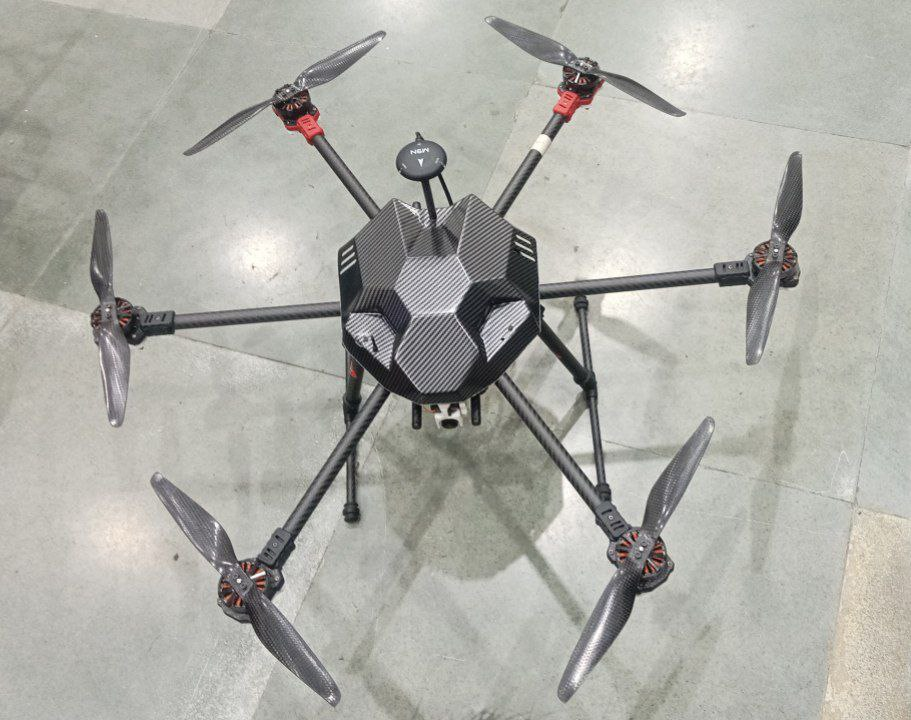

# Hexacopter
---
## 🧑‍💻 Author
**T.Jaswanth Reddy**    
• [LinkedIn](https://www.linkedin.com/in/thugu-jaswanth-reddy-12a72828b/)

---
## 🛰️ Overview
This project features a **custom-built hexacopter drone** designed for **aerial surveillance and monitoring**.  
The drone integrates a high-resolution **camera system capable of vertical motion (0° to 90°)**, enabling detailed forward-level to ground-level observation during flight.  
Built for stability, control, and real-time video monitoring, this system demonstrates the fusion of **aeronautical design, embedded control systems, and computer vision**.

---

## ⚙️ Features
- 🚁 **Hexacopter design** for enhanced stability and payload capacity  
- 🎥 **Vertical camera rotation (0° to 90°)** for wide-angle surveillance  
- 🧭 Integrated GPS module for position hold and waypoint navigation  
- 🧠 Real-time video transmission for monitoring and analysis  
- ⚡ Modular design allowing for easy maintenance and upgrades  
- 🔋 Power-efficient ESC and motor configuration for extended flight time  

---

## 🧩 Hardware Used
- Hexacopter carbon-fiber frame  
- Brushless DC motors (6x)  
- Electronic Speed Controllers (ESCs)  
- Flight Controller : Pixhawk  
- GPS module  
- system for camera tilt  
- FPV camera and transmitter system
- LiPo battery  
- remote transmitter  

---

## 🧠 Software & Tools
- **Software:** QGroundControl
- **Firmware:** PX4

---

## 🚀 Working Principle
1. The flight controller stabilizes the drone using onboard sensors (IMU, barometer, GPS).  
2. The camera, mounted on a servo or gimbal, tilts vertically within a range of **0° to 90°**, enabling forward to down surveillance.  
3. Real-time video is transmitted to a base station or FPV goggles for live monitoring.  
4. The drone can perform manual or semi-autonomous missions for surveillance and data collection.

---

## 📸 Demo
Below is an image of the assembled hexacopter used in this project:

---

## 🔧 Future Enhancements
- Integration of object detection using onboard AI (TensorFlow Lite / OpenCV).  
- Autonomous path planning with ROS 2 Navigation Stack.  
- Thermal or infrared camera module for night surveillance.  

---

## 📜 License
This project is open-source and distributed under the **MIT License**.  
You are free to use, modify, and distribute it with proper attribution.
